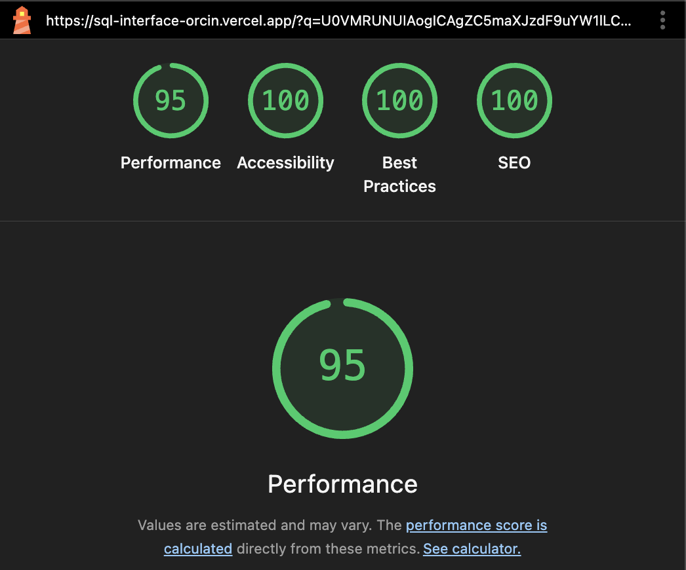
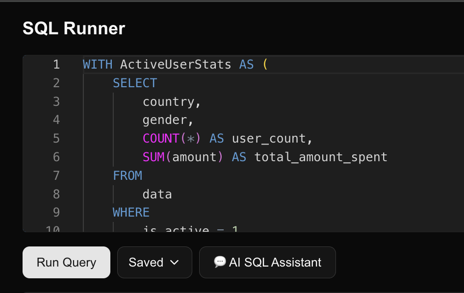
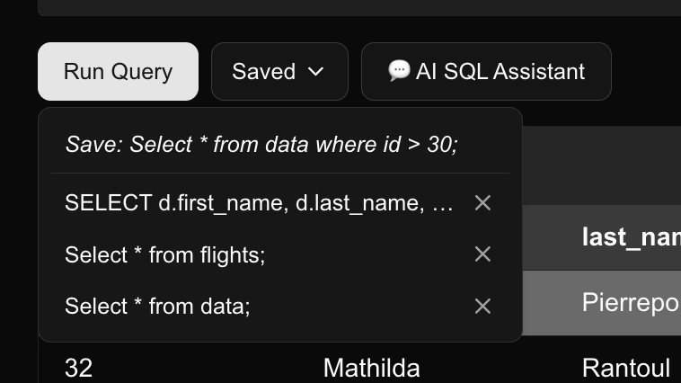
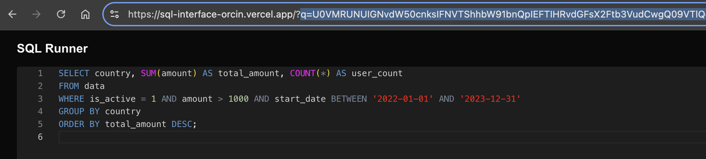
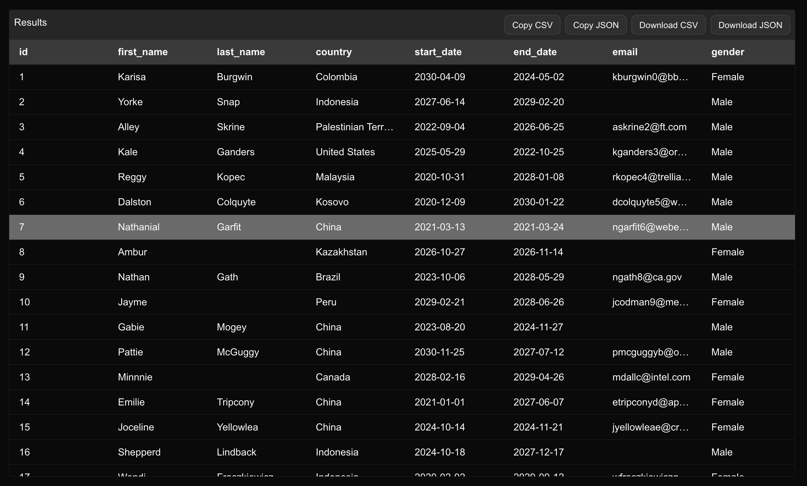

# SQL Playground with AI Assistant

A lightweight, interactive SQL runner built with **Next.js**, **React**, and **shadcn/ui**.  
This project combines a familiar SQL editing experience with advanced features like AI-assisted query generation, saved queries, and result table virtualization.  

### See live on https://sql-interface-orcin.vercel.app/

See Filters prefilled: [Prefilled 1](https://sql-interface-orcin.vercel.app/?q=U0VMRUNUIAogICAgZC5maXJzdF9uYW1lLCAKICAgIGQubGFzdF9uYW1lLCAKICAgIGQuY291bnRyeSwgCiAgICBkLmVtYWlsLCAKICAgIGQuYW1vdW50LAogICAgKFNFTEVDVCBTVU0oYW1vdW50KSBGUk9NIGRhdGEgV0hFUkUgaXNfYWN0aXZlID0gMSkgQVMgdG90YWxfYWN0aXZlX2Ftb3VudApGUk9NIAogICAgZGF0YSBkCldIRVJFIAogICAgZC5pc19hY3RpdmUgPSAxCk9SREVSIEJZIAogICAgZC5hbW91bnQgREVTQzsK) | [Prefilled Link 2](https://sql-interface-orcin.vercel.app/?q=U0VMRUNUIGZsaWdodF9udW1iZXIsIGRlcGFydHVyZV9jb3VudHJ5LCBhcnJpdmFsX2NvdW50cnkKRlJPTSBmbGlnaHRzCldIRVJFIChkZXBhcnR1cmVfY291bnRyeSA9ICdDaGluYScgQU5EIGFycml2YWxfY291bnRyeSA9ICdSdXNzaWEnKQogICBPUiAoZGVwYXJ0dXJlX2NvdW50cnkgPSAnUnVzc2lhJyBBTkQgYXJyaXZhbF9jb3VudHJ5ID0gJ0NoaW5hJyk7Cg%3D%3D)

---

## 🛠️ Tech Stack
- **Next.js**
- **React + TypeScript**
- **shadcn/ui** for modern UI components
- **Tailwind CSS** for styling
- **OpenAI API** for AI assistant
- **React Virtuoso** for virtualized tables

---
## Lighthouse score



---

## 📂 Project Structure

```
/app
/api/query         → API route for SQL execution
/components        → UI components (editor, table, popovers, etc.)
/providers         → Context providers (SQLProvider, AI context)
/utils             → Reusable hooks (useQueryState, useFetch, useSafeLocalStorage)
```

---

## 🚦 Getting Started

```bash
# Clone repository
git clone <repo-url>

# Install dependencies
yarn install

# Add environment variables
echo "OPENAI_API_KEY=your-key-here" > .env.local

# Run dev server
yarn dev

App runs at http://localhost:3000.
```

---

### 📌 Roadmap
- Multi-tab query editor
- Schema explorer panel
- Query history with timestamps
- Export results in multiple formats (XLSX, Parquet)
- Improved AI schema training
- Collaboration features (share queries with team)

---

## Features

### 🔎 SQL Runner
- Write and execute SQL queries directly in the browser.
- Results are displayed in a fast, scrollable, **virtualized table** that supports large datasets.



---

### 💾 Saved Queries
- Save frequently used queries to **localStorage**.
- Quickly re-run saved queries using a simple popover interface.
- Delete saved queries with a single click.



---

### 🧠 AI Assistant
- Generate queries with natural language using an **AI-powered assistant**.
- Assistant is **context-aware** — it understands your schema and suggests valid queries.
- Intelligent markdown + streaming response support for smooth AI interaction.


---


---

### 🔗 URL Hashing
- Queries are **encoded into the URL** (via base64) for easy sharing and persistence.
- Refresh or share the link and your query state is preserved.



---

### ⚡ Result Table Virtualization
- Handles thousands of rows without performance issues.
- Smooth scrolling and instant rendering using virtualization.



---

### 📤 Export & Copy
- **Copy results** as CSV or JSON with one click.
- **Download results** as CSV or JSON for offline use.
- Perfect for integrating query results into reports or other workflows.


---

### 🎯 Context-Aware AI Solutions
- Schema is passed into the AI assistant for **better, contextually correct queries**.
- Supports “Use Query” action to directly insert AI-generated SQL into the runner.


---

## 📊 Demo Schema & Data

Two sample tables are preloaded for you to explore and query with both SQL and the AI Assistant.  

### **1. `data`**
| Column       | Type     |
|--------------|----------|
| id           | INTEGER  |
| first_name   | TEXT     |
| last_name    | TEXT     |
| country      | TEXT     |
| start_date   | DATE     |
| end_date     | DATE     |
| email        | TEXT     |
| gender       | TEXT     |
| amount       | INTEGER  |
| website      | TEXT     |
| image_url    | TEXT     |
| is_active    | INTEGER  |

#### Example Rows
| id | first_name | last_name | country   | start_date | end_date   | email                | gender | amount | website             | image_url                    | is_active |
|----|------------|-----------|-----------|------------|------------|----------------------|--------|--------|---------------------|------------------------------|-----------|
| 1  | Alice      | Johnson   | USA       | 2023-01-10 | 2023-06-15 | alice@example.com    | F      | 1200   | https://alice.com   | https://picsum.photos/200/1  | 1         |
| 2  | Bob        | Smith     | Canada    | 2023-02-20 | 2023-07-05 | bob@example.com      | M      | 850    | https://bobsmith.ca | https://picsum.photos/200/2  | 0         |
| 3  | Clara      | Müller    | Germany   | 2023-03-01 | 2023-08-12 | clara@example.de     | F      | 2100   | https://claram.de   | https://picsum.photos/200/3  | 1         |

---

### **2. `flights`**
| Column             | Type     |
|--------------------|----------|
| flight_number      | TEXT     |
| airline_name       | TEXT     |
| departure_airport  | TEXT     |
| departure_city     | TEXT     |
| departure_country  | TEXT     |
| departure_time     | TEXT     | <!-- stored as "HH:MM AM/PM" -->
| arrival_airport    | TEXT     |
| arrival_city       | TEXT     |
| arrival_country    | TEXT     |
| duration_hours     | INTEGER  |
| passenger_name     | TEXT     |
| passenger_age      | INTEGER  |
| passenger_gender   | TEXT     |
| passenger_nationality | TEXT  |
| seat_number        | TEXT     |

#### Example Rows
| flight_number | airline_name | departure_airport | departure_city | departure_country | departure_time | arrival_airport | arrival_city | arrival_country | duration_hours | passenger_name | passenger_age | passenger_gender | passenger_nationality | seat_number |
|---------------|--------------|-------------------|----------------|------------------|----------------|-----------------|--------------|-----------------|----------------|----------------|---------------|-----------------|----------------------|-------------|
| AA101         | American Air | JFK               | New York       | USA              | 08:30 AM       | LHR             | London       | UK              | 7              | John Doe       | 34            | M               | USA                  | 12A         |
| LH404         | Lufthansa    | FRA               | Frankfurt      | Germany          | 01:15 PM       | JFK             | New York     | USA             | 9              | Anna Schmidt   | 28            | F               | Germany              | 22C         |
| AI202         | Air India    | DEL               | New Delhi      | India            | 11:45 PM       | DXB             | Dubai        | UAE             | 3              | Raj Patel      | 41            | M               | India                | 18B         |

---